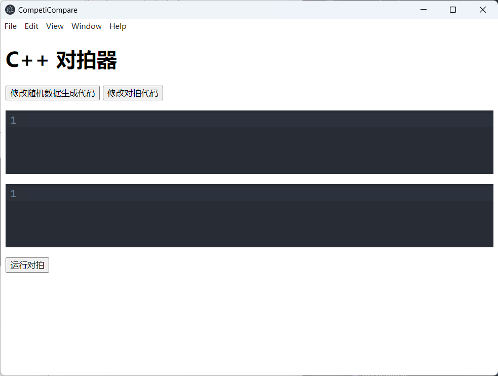

# CompetiCompare
一个简单的C++代码对拍器，基于[Electron](https://www.electronjs.org/)构建

## 预览


## 安装依赖
```bash
npm install
```
> 安装JetBrainsMono字体以获得最佳体验[nerdfont下载](https://www.nerdfonts.com/font-downloads)
## 构建
```bash
npm run build
```
## 运行
```
npm start
```
